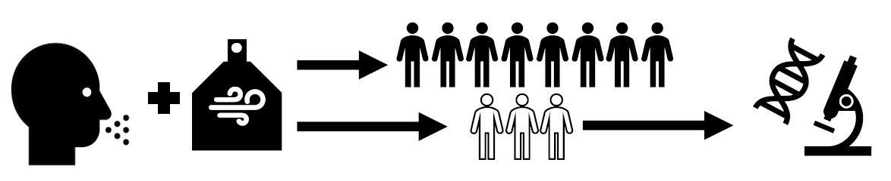

<p align="left">
  <a href="https://github.com/Leonardojarab?tab=repositories">
    
  </a>
  <a href="https://www.linkedin.com/in/leonardo-jara-454449a4/">
    
  </a>
</p>
<p align="center">
  <a href="https://github.com/Leonardojarab?tab=repositories">
    
  </a>
</p>


<p>
  
  
  
  
  
  
</p>

# 🧪 Enose Classification Project  

This repository contains a pipeline for processing, visualizing, and classifying **electronic nose (eNose) signal data** for three groups of patients.  

The dataset used in this project comes from a **publicly available study**:  
👉 [Mendeley Data – eNose signals dataset](https://data.mendeley.com/datasets/h5pcn99zw4/5)  

This repository is designed to **emulate a real-world research workflow** using eNose data. In practice, our main experiments are performed on a much larger dataset that cannot be shared due to **privacy restrictions**, but this public dataset provides a reproducible reference for testing and demonstrating the pipeline.  

---

## 📂 Project Structure

```
.
├── data/                   # Folder with datasets (CONTROL.csv, COPD.csv, SMOKERS.csv, General_data_from_the_dataset.csv)
├── src/                    # Source code with custom modules
│   ├── format.py           # Data formatting and preprocessing
│   ├── signal.py           # Signal correlation checks and visualization
│   ├── pca.py              # PCA and dimensionality reduction utilities
│   ├── split.py            # Dataset train/test split function
│   ├── xgboost_func.py     # XGBoost model training with GridSearchCV
│   └── metrics_func.py     # Multiclass evaluation metrics
├── main.py                 # Main script to run the pipeline
└── README.md               # Project documentation
```

---

## ⚙️ Workflow

1. **Data Formatting**  
   - Combines signals from 8 sensors for each patient.  
   - Creates a structured DataFrame with metadata (`sex`, `age`, `target`) and signals (`t0, t1, ..., tn`).  

2. **Signal Correlation Check**  
   - Verifies correlation between repeated signals (two recordings per sensor).  

3. **PCA (Principal Component Analysis)**  
   - Reduces dimensionality of signals.  
   - `pca_elbow()` determines the optimal number of components.  
   - Results are plotted with class labels.  

4. **XGBoost Multiclass Classification**  
   - Trains an `XGBClassifier` with grid search and cross-validation.  
   - Compares performance with/without metadata (`sex`, `age`).  

5. **Evaluation Metrics**  
   - Accuracy, Precision, Recall, F1-score, Balanced Accuracy.  
   - Confusion Matrix and Classification Report.  
   - ROC AUC (macro average, OvR strategy).  

---

## 📊 Example PCA Visualization

Example of PCA projection showing separation between classes:

```
Patient_ID → {C: Control, D: COPD, S: Smoker}
```

---

## 🚀 Installation

Clone the repository and install dependencies:

```bash
git clone https://github.com/your-username/enose-copd.git
cd enose-copd
pip install -r requirements.txt
```

---

## ▶️ Usage

Run the main script:

```bash
python main.py
```

---

## 📦 Requirements

Main libraries used in the project:

- Python 3.9+  
- pandas  
- numpy  
- matplotlib  
- scikit-learn  
- xgboost  
- mplcursors  

Install them via:

```bash
pip install -r requirements.txt
```

---

## 📜 License

This project is licensed under the MIT License.  
Feel free to use and modify with attribution.
